# 亲健系统数据库 ER 图

生成依据：

- ORM 模型：[backend/app/models/__init__.py](../backend/app/models/__init__.py)
- 迁移目录：[backend/alembic/versions](../backend/alembic/versions)
- 本地图谱校验库：[backend/qinjian.db](../backend/qinjian.db)

说明：

- `users` 是用户主体表。
- `pairs` 是关系空间主体表，使用 `user_a_id`、`user_b_id` 表达双方关系。
- 打卡、报告、任务、预警、AI 会话、关系智能、干预方案等业务数据都围绕 `users` 与 `pairs` 展开。
- `alembic_version` 是数据库迁移版本表，不纳入业务 ER 主图。

```mermaid
erDiagram
    USERS {
        UUID id PK
        string email
        string phone
        string nickname
        string password_hash
        string avatar_url
        string wechat_openid
        string wechat_unionid
        string wechat_avatar
        json product_prefs
        datetime created_at
    }

    PAIRS {
        UUID id PK
        UUID user_a_id FK
        UUID user_b_id FK
        string type
        string status
        string invite_code
        UUID unbind_requested_by FK
        datetime unbind_requested_at
        datetime created_at
        string attachment_style_a
        string attachment_style_b
        datetime attachment_analyzed_at
        bool is_long_distance
        string custom_partner_nickname_a
        string custom_partner_nickname_b
        json task_planner_settings
    }

    PAIR_CHANGE_REQUESTS {
        UUID id PK
        UUID pair_id FK
        string kind
        string status
        string requested_type
        UUID requester_user_id FK
        UUID approver_user_id FK
        bool allow_retention
        string phase
        datetime expires_at
        string resolution_reason
        datetime decided_at
        datetime created_at
    }

    PAIR_CHANGE_REQUEST_MESSAGES {
        UUID id PK
        UUID request_id FK
        UUID sender_user_id FK
        text message
        datetime created_at
    }

    CHECKINS {
        UUID id PK
        UUID pair_id FK
        UUID user_id FK
        text content
        string image_url
        string voice_url
        json mood_tags
        float sentiment_score
        json client_context
        string archive_title
        text archive_summary
        json archive_tags
        int mood_score
        int interaction_freq
        string interaction_initiative
        bool deep_conversation
        bool task_completed
        date checkin_date
        datetime raw_retention_until
        datetime raw_deleted_at
        datetime created_at
    }

    REPORTS {
        UUID id PK
        UUID pair_id FK
        UUID user_id FK
        string type
        string status
        json content
        float health_score
        date report_date
        datetime created_at
    }

    RELATIONSHIP_TREES {
        UUID id PK
        UUID pair_id FK
        int growth_points
        string level
        json milestones
        json energy_state
        date last_watered
        datetime created_at
    }

    RELATIONSHIP_TASKS {
        UUID id PK
        UUID pair_id FK
        UUID user_id FK
        UUID created_by_user_id FK
        UUID parent_task_id FK
        string title
        text description
        string category
        string source
        string importance_level
        string status
        date due_date
        datetime completed_at
        datetime created_at
    }

    LONG_DISTANCE_ACTIVITIES {
        UUID id PK
        UUID pair_id FK
        string type
        string title
        string status
        UUID created_by FK
        datetime completed_at
        datetime created_at
    }

    MILESTONES {
        UUID id PK
        UUID pair_id FK
        string type
        string title
        date date
        bool reminder_sent
        datetime created_at
    }

    COMMUNITY_TIPS {
        UUID id PK
        string target_pair_type
        string title
        text content
        bool ai_generated
        datetime created_at
    }

    USER_NOTIFICATIONS {
        UUID id PK
        UUID user_id FK
        string type
        text content
        string target_path
        bool is_read
        datetime created_at
    }

    CRISIS_ALERTS {
        UUID id PK
        UUID pair_id FK
        UUID report_id FK
        string level
        string previous_level
        string status
        string intervention_type
        string intervention_title
        text intervention_desc
        json action_items
        float health_score
        UUID acknowledged_by FK
        datetime acknowledged_at
        datetime resolved_at
        text resolve_note
        datetime created_at
    }

    AGENT_CHAT_SESSIONS {
        UUID id PK
        UUID user_id FK
        UUID pair_id FK
        string status
        bool has_extracted_checkin
        date session_date
        datetime expires_at
        json summary_json
        datetime summary_updated_at
        datetime created_at
        datetime updated_at
    }

    AGENT_CHAT_MESSAGES {
        UUID id PK
        UUID session_id FK
        string role
        text content
        json payload
        datetime created_at
    }

    RELATIONSHIP_EVENTS {
        UUID id PK
        UUID pair_id FK
        UUID user_id FK
        string event_type
        string entity_type
        string entity_id
        string source
        json payload
        string idempotency_key
        datetime occurred_at
        datetime created_at
    }

    RELATIONSHIP_PROFILE_SNAPSHOTS {
        UUID id PK
        UUID pair_id FK
        UUID user_id FK
        int window_days
        date snapshot_date
        json metrics_json
        json risk_summary
        json attachment_summary
        json suggested_focus
        json behavior_summary
        datetime generated_from_event_at
        string version
        datetime created_at
    }

    INTERVENTION_PLANS {
        UUID id PK
        UUID pair_id FK
        UUID user_id FK
        string plan_type
        UUID trigger_event_id FK
        UUID trigger_snapshot_id FK
        string risk_level
        json goal_json
        string status
        date start_date
        date end_date
        string owner_version
        datetime created_at
        datetime updated_at
    }

    PLAYBOOK_RUNS {
        UUID id PK
        UUID plan_id FK
        UUID pair_id FK
        UUID user_id FK
        string plan_type
        string status
        int current_day
        string active_branch
        text branch_reason
        datetime branch_started_at
        datetime last_synced_at
        datetime last_viewed_at
        int transition_count
        datetime created_at
        datetime updated_at
    }

    PLAYBOOK_TRANSITIONS {
        UUID id PK
        UUID run_id FK
        UUID plan_id FK
        UUID pair_id FK
        UUID user_id FK
        string transition_type
        string trigger_type
        text trigger_summary
        int from_day
        int to_day
        string from_branch
        string to_branch
        datetime created_at
    }

    INTERVENTION_POLICY_LIBRARY {
        UUID id PK
        string policy_id
        string plan_type
        string title
        text summary
        string branch
        string branch_label
        string intensity
        string intensity_label
        string copy_mode
        string copy_mode_label
        text when_to_use
        text success_marker
        text guardrail
        string version
        string status
        string source
        int sort_order
        json metadata_json
        datetime created_at
        datetime updated_at
    }

    PRIVACY_DELETION_REQUESTS {
        UUID id PK
        UUID user_id FK
        string status
        datetime requested_at
        datetime scheduled_for
        datetime cancelled_at
        datetime executed_at
        UUID reviewed_by FK
        text review_note
    }

    USER_INTERACTION_EVENTS {
        UUID id PK
        UUID user_id FK
        UUID pair_id FK
        string session_id
        string source
        string event_type
        string page
        string path
        string http_method
        int http_status
        string target_type
        string target_id
        json payload
        datetime occurred_at
        datetime created_at
    }

    UPLOAD_ASSETS {
        UUID id PK
        string storage_path
        string subdir
        string filename
        UUID owner_user_id FK
        UUID pair_id FK
        string scope
        datetime created_at
    }

    USERS ||--o{ PAIRS : "user_a_id"
    USERS ||--o{ PAIRS : "user_b_id"
    USERS ||--o{ PAIRS : "unbind_requested_by"

    PAIRS ||--o{ PAIR_CHANGE_REQUESTS : "pair_id"
    USERS ||--o{ PAIR_CHANGE_REQUESTS : "requester_user_id"
    USERS ||--o{ PAIR_CHANGE_REQUESTS : "approver_user_id"
    PAIR_CHANGE_REQUESTS ||--o{ PAIR_CHANGE_REQUEST_MESSAGES : "request_id"
    USERS ||--o{ PAIR_CHANGE_REQUEST_MESSAGES : "sender_user_id"

    PAIRS ||--o{ CHECKINS : "pair_id"
    USERS ||--o{ CHECKINS : "user_id"
    PAIRS ||--o{ REPORTS : "pair_id"
    USERS ||--o{ REPORTS : "user_id"

    PAIRS ||--o| RELATIONSHIP_TREES : "pair_id"
    PAIRS ||--o{ RELATIONSHIP_TASKS : "pair_id"
    USERS ||--o{ RELATIONSHIP_TASKS : "user_id"
    USERS ||--o{ RELATIONSHIP_TASKS : "created_by_user_id"
    RELATIONSHIP_TASKS ||--o{ RELATIONSHIP_TASKS : "parent_task_id"

    PAIRS ||--o{ LONG_DISTANCE_ACTIVITIES : "pair_id"
    USERS ||--o{ LONG_DISTANCE_ACTIVITIES : "created_by"
    PAIRS ||--o{ MILESTONES : "pair_id"
    USERS ||--o{ USER_NOTIFICATIONS : "user_id"

    PAIRS ||--o{ CRISIS_ALERTS : "pair_id"
    REPORTS ||--o{ CRISIS_ALERTS : "report_id"
    USERS ||--o{ CRISIS_ALERTS : "acknowledged_by"

    USERS ||--o{ AGENT_CHAT_SESSIONS : "user_id"
    PAIRS ||--o{ AGENT_CHAT_SESSIONS : "pair_id"
    AGENT_CHAT_SESSIONS ||--o{ AGENT_CHAT_MESSAGES : "session_id"

    PAIRS ||--o{ RELATIONSHIP_EVENTS : "pair_id"
    USERS ||--o{ RELATIONSHIP_EVENTS : "user_id"
    PAIRS ||--o{ RELATIONSHIP_PROFILE_SNAPSHOTS : "pair_id"
    USERS ||--o{ RELATIONSHIP_PROFILE_SNAPSHOTS : "user_id"

    PAIRS ||--o{ INTERVENTION_PLANS : "pair_id"
    USERS ||--o{ INTERVENTION_PLANS : "user_id"
    RELATIONSHIP_EVENTS ||--o{ INTERVENTION_PLANS : "trigger_event_id"
    RELATIONSHIP_PROFILE_SNAPSHOTS ||--o{ INTERVENTION_PLANS : "trigger_snapshot_id"

    INTERVENTION_PLANS ||--o| PLAYBOOK_RUNS : "plan_id"
    PAIRS ||--o{ PLAYBOOK_RUNS : "pair_id"
    USERS ||--o{ PLAYBOOK_RUNS : "user_id"
    PLAYBOOK_RUNS ||--o{ PLAYBOOK_TRANSITIONS : "run_id"
    INTERVENTION_PLANS ||--o{ PLAYBOOK_TRANSITIONS : "plan_id"
    PAIRS ||--o{ PLAYBOOK_TRANSITIONS : "pair_id"
    USERS ||--o{ PLAYBOOK_TRANSITIONS : "user_id"

    USERS ||--o{ PRIVACY_DELETION_REQUESTS : "user_id"
    USERS ||--o{ PRIVACY_DELETION_REQUESTS : "reviewed_by"

    USERS ||--o{ USER_INTERACTION_EVENTS : "user_id"
    PAIRS ||--o{ USER_INTERACTION_EVENTS : "pair_id"

    USERS ||--o{ UPLOAD_ASSETS : "owner_user_id"
    PAIRS ||--o{ UPLOAD_ASSETS : "pair_id"
```

## 业务分组

| 分组 | 数据表 |
| --- | --- |
| 用户与关系空间 | `users`, `pairs`, `pair_change_requests`, `pair_change_request_messages` |
| 日常记录与分析 | `checkins`, `reports`, `crisis_alerts` |
| 关系成长与任务 | `relationship_trees`, `relationship_tasks`, `long_distance_activities`, `milestones`, `community_tips`, `user_notifications` |
| AI 会话 | `agent_chat_sessions`, `agent_chat_messages` |
| 关系智能与干预 | `relationship_events`, `relationship_profile_snapshots`, `intervention_plans`, `playbook_runs`, `playbook_transitions`, `intervention_policy_library` |
| 合规与审计 | `privacy_deletion_requests`, `user_interaction_events`, `upload_assets` |

