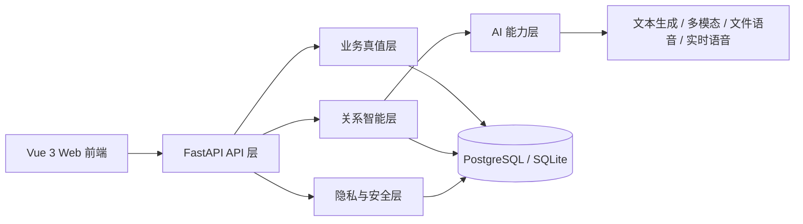
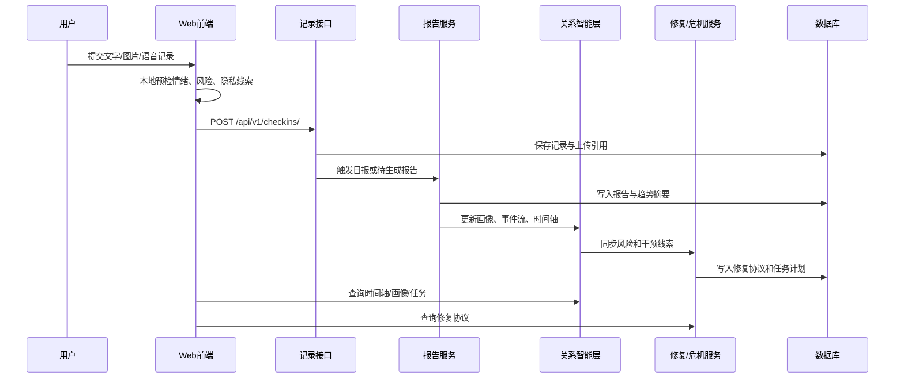

# 亲健 - 软件应用与开发类作品设计和开发文档

> 更新时间：2026-04-25  
> 使用场景：本文件作为当前仓库唯一保留的设计和开发文档主稿，可继续排版为比赛提交 PDF / DOCX。写法已按 2026 版软件应用与开发类模板收敛，重点突出真实问题、完整闭环、可运行实现和可验证证据。

## 一、需求分析

### 1.1 开发背景

当代青年在情侣、朋友、异地陪伴、单人自我整理等泛亲密关系中，常见困难并不是“不知道要沟通”，而是缺少持续记录、结构化复盘和低刺激修复的工具。现有产品通常分为三类：记录型工具可以保存情绪和事件，但难以形成关系判断；内容型工具可以提供知识，但无法贴合某一段关系的真实上下文；聊天型 AI 可以即时回答，但缺少长期状态、证据链和隐私治理。

“亲健”的目标是把生成式 AI 从一次性问答工具，落到一套可持续使用的软件系统中。系统围绕“记录 -> 评估 -> 干预 -> 修复 -> 回看”的闭环设计，帮助用户看见关系状态、降低沟通刺激、保留复盘依据，并在高风险场景下明确边界和转介方向。

### 1.2 目标用户

- 有长期关系维护需求的青年用户。
- 希望在沟通前获得表达辅助、在冲突后获得修复路径的用户。
- 需要通过记录、简报和时间轴回看关系变化的用户。
- 希望在不暴露真实敏感信息的前提下使用 AI 辅助整理的用户。

### 1.3 产品定位

本作品定位为“基于生成式 AI 的泛亲密关系智能感知与维系平台”。系统覆盖情侣、朋友、异地关系与单人自我整理场景，不把产品限定为单一情侣工具，而是面向多种亲密连接中的记录、理解、沟通和修复需求。

### 1.4 竞品比较

| 维度 | 亲健 | 记录型产品 | 内容型产品 | 聊天型 AI |
| --- | --- | --- | --- | --- |
| 长期状态积累 | 支持 | 支持 | 弱 | 部分支持 |
| 结构化关系判断 | 支持 | 弱 | 弱 | 部分支持 |
| 下一步行动建议 | 支持 | 弱 | 支持 | 部分支持 |
| 双视角整理 | 支持 | 不支持 | 不支持 | 弱 |
| 冲突修复链路 | 支持 | 不支持 | 部分支持 | 弱 |
| 时间轴回看与证据沉淀 | 支持 | 部分支持 | 弱 | 弱 |
| 隐私治理入口 | 支持 | 部分支持 | 不明确 | 不明确 |

### 1.5 功能需求

| 功能模块 | 当前实现内容 |
| --- | --- |
| 账号与资料 | 邮箱/手机号注册登录、验证码、密码重置、资料更新、头像签名访问、演示账号能力 |
| 关系协作 | 创建关系、10 位邀请码、加入预览、加入请求确认、关系类型切换、备注名、断绝关系挽留与留痕 |
| 今日记录 | 文字、图片、语音输入，本地预检情绪、风险和隐私线索 |
| 智能简报 | 日报、周报、月报、趋势回看、报告范围选择与真实数据空状态 |
| 智能陪伴 | 会话复用、会话记忆、消息预演、实时语音转写、语音证据绑定 |
| 关系智能 | 关系画像、关系事件流、行为判断、互动事件、叙事对齐、时间轴归档 |
| 干预修复 | 修复协议、关系 playbook、今日任务、手动任务、任务优先级和刷新冷却 |
| 成长扩展 | 关系树能量、里程碑、异地关系、关系体检、依恋测试、社群提示 |
| 隐私安全 | 隐私中心、审计记录、删除申请、私有上传、签名访问、文本脱敏、隐私运行时 |
| 演示支持 | 内置 demo 模式、样例关系数据、纯静态预览入口、答辩演示脚本 |

### 1.6 非功能需求

- 可运行性：前后端分离，支持本地开发、Docker Compose 部署和 Nginx 反向代理。
- 可验证性：核心能力具备自动化测试覆盖，并能通过构建验证生成正式部署产物。
- 可扩展性：关系类型、任务策略、AI 模型和隐私策略均通过服务层隔离，便于后续扩展。
- 安全性：敏感关系数据默认不裸露，上传资源使用签名访问，生产弱配置会被拦截。
- 演示稳定性：答辩现场可使用 demo 模式展示完整闭环，避免真实账号和实时生成波动影响讲解。

## 二、概要设计

### 2.1 系统总体架构



### 2.2 技术路线

| 层级 | 技术与目录 | 主要职责 |
| --- | --- | --- |
| 前端表现层 | `web-vue3`，Vue 3、Vite、Vue Router、Pinia | 登录、关系空间、记录、简报、预演、修复、时间轴、隐私中心等页面 |
| API 层 | `backend/app/api/v1`，FastAPI | 鉴权、参数校验、路由编排、权限控制和响应模型 |
| 业务真值层 | `backend/app/models` 与 `backend/app/services` | 用户、关系、记录、报告、任务、上传、危机等核心数据 |
| 关系智能层 | `relationship_*`、`timeline_*`、`behavior_judgement` | 把离散记录沉淀为事件流、画像、任务、叙事和归档 |
| AI 能力层 | `backend/app/ai` | 文本分析、多模态分析、消息预演、叙事对齐、实时语音与文件语音 |
| 隐私安全层 | `privacy_*`、`upload_access`、`guidance_policy` | 脱敏、审计、删除申请、签名访问、隐私运行时和安全策略 |
| 部署层 | Docker Compose、Nginx | 容器编排、反向代理、安全响应头和静态产物服务 |

### 2.3 模块调用关系



### 2.4 代表接口

| 模块 | 代表接口 | 说明 |
| --- | --- | --- |
| 认证 | `/api/v1/auth/register` `/api/v1/auth/login` `/api/v1/auth/phone/login` | 账号注册、登录、手机号验证码 |
| 资料 | `/api/v1/auth/me` `/api/v1/auth/profile-update/*` | 资料更新、绑定信息变更确认 |
| 关系管理 | `/api/v1/pairs/create` `/api/v1/pairs/join/preview` `/api/v1/pairs/{pair_id}/type` | 创建关系、加入预览、关系类型切换 |
| 关系变更 | `/api/v1/pairs/{pair_id}/break-request` | 断绝关系申请、挽留接受、拒绝与自动结束 |
| 记录 | `/api/v1/checkins/` `/api/v1/checkins/today` | 每日记录提交与查询 |
| 上传 | `/api/v1/upload/image` `/api/v1/upload/voice` `/api/v1/upload/access/*` | 图片、语音、签名访问 |
| 简报 | `/api/v1/reports/generate-daily` `/api/v1/reports/latest` `/api/v1/reports/trend` | 日报/周报/月报和趋势查询 |
| 智能陪伴 | `/api/v1/agent/sessions` `/api/v1/agent/chat` `/api/v1/agent/asr/ws-ticket` | 会话复用、聊天、实时语音 |
| 预演对齐 | `/api/v1/agent/simulate-message` `/api/v1/insights/alignment/generate` | 消息预演、双视角叙事对齐 |
| 任务 | `/api/v1/tasks/daily/{pair_id}` `/api/v1/tasks/manual/{pair_id}` `/api/v1/tasks/{task_id}/feedback` | 系统任务、手动任务、反馈回收 |
| 时间轴 | `/api/v1/insights/timeline/archive` | 时间轴归档与隐私分层展示 |
| 关系树 | `/api/v1/tree/status` `/api/v1/tree/collect` | 关系树能量状态与收集 |
| 危机修复 | `/api/v1/crisis/status/{pair_id}` `/api/v1/crisis/protocol/{pair_id}` | 风险状态和修复协议 |
| 隐私 | `/api/v1/privacy/status` `/api/v1/privacy/audit/me` `/api/v1/privacy/delete-request` | 隐私状态、审计、删除申请 |
| 管理 | `/api/v1/admin/decision-replay` `/api/v1/admin/policies` | 决策回放、策略管理、审计辅助 |

## 三、详细设计

### 3.1 典型业务闭环

1. 用户登录或进入 demo 模式，选择单人整理或进入关系空间。
2. 用户创建关系、输入邀请码或确认加入请求，关系正式激活后进入协作空间。
3. 用户通过文字、图片或语音完成今日记录，前端先进行情绪、风险、隐私本地预检。
4. 后端保存记录并生成简报，关系智能层沉淀画像、事件流和趋势信息。
5. 用户在沟通前使用消息预演和双视角叙事对齐，获得更低刺激的表达建议。
6. 当风险升高时，系统生成修复协议和可执行任务，并把过程写入时间轴。
7. 用户在关系简报、时间轴和隐私中心中回看、导出或治理自己的数据。

### 3.2 核心页面

| 页面 | 设计重点 |
| --- | --- |
| 登录/注册页 | 提供账号密码、手机号验证码、演示入口和协议提示，降低答辩现场准备成本 |
| 关系管理页 | 统一处理创建、加入、预览、确认、切换和解绑，避免单方操作直接改变关系状态 |
| 关系空间页 | 展示关系状态、今日任务、能量节点、关键趋势和下一步行动 |
| 今日记录页 | 支持文字、图片、语音和本地预检，把输入变成后续简报与画像的原始依据 |
| 关系简报页 | 展示日报/周报/月报、关键观察、建议动作、趋势和空状态说明 |
| 消息预演页 | 对待发送内容进行风险解释、表达改写和注意事项提示 |
| 双视角对齐页 | 将双方记录整理为共同版本、A/B 视角、误读风险和桥接动作 |
| 修复协议页 | 根据风险等级和近期事件生成分步骤修复建议、禁忌行为和成功信号 |
| 时间轴页 | 按权限展示原文、摘要、报告、修复和归档证据，支持复盘 |
| 隐私安全页 | 展示同步策略、辅助整理开关、审计记录、删除申请和数据边界 |

### 3.3 数据库设计

| 实体 | 作用 | 设计说明 |
| --- | --- | --- |
| `users` | 用户账号、资料和偏好 | 保存账号、手机号、头像、隐私和产品偏好 |
| `pairs` | 关系对象 | 统一承载情侣、朋友、单人等关系上下文 |
| `pair_change_requests` | 加入、切换、断绝等请求 | 保证关系变更需要协作确认和状态留痕 |
| `checkins` | 每日记录 | 保存文字、图片、语音引用及背景信息 |
| `upload_assets` | 上传资产 | 保存上传归属、访问范围和稳定存储路径 |
| `reports` | 日报/周报/月报 | 保存总结、趋势、建议和展示内容 |
| `relationship_events` | 关系事件流 | 为画像、时间轴、行为判断和归档提供统一事件基底 |
| `relationship_profile_snapshots` | 画像快照 | 保存阶段性关系判断，避免每次临时推断 |
| `agent_chat_sessions` / `agent_chat_messages` | AI 会话与消息 | 支持会话复用、摘要记忆和语音证据 |
| `intervention_plans` | 干预计划 | 组织阶段性建议和执行优先级 |
| `relationship_tasks` | 任务 | 支撑系统任务、手动任务、反馈和重要性排序 |
| `playbook_runs` / `playbook_transitions` | 剧本运行态 | 表示连续干预如何推进和切换 |
| `relationship_tree_energy_state` | 关系树能量 | 保存当天能量节点、领取状态和成长反馈 |
| `privacy_deletion_requests` | 删除申请 | 支撑数据删除、宽限期和治理流程 |
| `user_interaction_events` | 交互事件 | 保存标准化用户行为，供分析和决策回放使用 |

最终排版时建议直接使用仓库内已生成的 E-R 图：`output/qinjian-database-er.png`。

### 3.4 关键技术与创新点

#### 3.4.1 关系事件流与画像快照

系统不是对每次输入做一次性回答，而是把记录、报告、预演、对齐、任务、危机和归档沉淀为统一事件流，再生成阶段性画像快照。这让后续建议具有上下文连续性，也便于解释“为什么系统这样建议”。

#### 3.4.2 从建议到行动的闭环

亲健把“消息预演、双视角对齐、今日任务、修复协议、时间轴归档”串成连续链路。AI 输出不只停留在安慰或解释，而是落到可执行任务、修复步骤和后续复盘中。

#### 3.4.3 多模态输入与本地预检

前端支持文字、图片和语音输入，并在提交前完成情绪、风险、隐私线索预检。图片可采用“只保留分析结果”的策略，语音可进入实时或文件转写链路，减少用户手动整理成本。

#### 3.4.4 隐私治理工程化

系统实现了 JWT、密码哈希、签名访问、上传归属校验、隐私审计、删除申请、文本脱敏、生产弱配置拦截和安全响应头。隐私不是页面口号，而是贯穿上传、日志、访问和删除的工程机制。

#### 3.4.5 答辩演示稳定性

前端内置 demo 模式和样例数据，可直接展示关系空间、今日记录、简报、预演、修复、时间轴和隐私中心。答辩 PPT 建议采用中文高清纯绘画风格，不依赖系统截图；正式设计文档则可插入架构图、流程图、E-R 图和少量必要界面图。

## 四、测试报告

### 4.1 测试覆盖范围

| 维度 | 覆盖内容 |
| --- | --- |
| 认证与账号安全 | 注册登录、手机号验证码、密码重置、资料更新、弱配置拦截 |
| 关系管理 | 邀请码、加入预览、加入确认、关系类型切换、备注名、断绝关系流程 |
| 记录与上传 | 文字、图片、语音、私有上传、签名访问、归属校验 |
| 简报与关系智能 | 日报/周报/月报、报告范围、画像、时间轴、叙事对齐、行为判断 |
| 智能陪伴 | 会话复用、会话记忆、AI 超时、实时语音、语音证据 |
| 任务与修复 | 系统任务、手动任务、任务反馈、刷新冷却、修复协议 |
| 隐私治理 | 审计记录、删除申请、脱敏、隐私运行时、上传目录非公网直出 |
| 前端工具层 | 登录偏好、协议提示、首页摘要、关系空间、实时语音、报告内容、关系树 |

### 4.2 当前验证结果

| 指标 | 当前结果 |
| --- | --- |
| 后端测试收集 | `python -m pytest --collect-only -q` 收集 `223` 条测试 |
| 前端工具层测试 | `npm test -- --run`，`101/101` 通过 |
| 前端生产构建 | `npm run build` 通过，已生成 `web-vue3/dist/` |
| 冒烟与压测脚本 | `output/frontend_real_env_smoke.py`、`output/mobile_account_smoke.py`、`output/api_light_pressure.py` 可用于最终提交前重新生成证据 |

### 4.3 测试结论

当前工程已经具备“可运行、可构建、可测试、可演示”的基础。后端测试覆盖认证安全、关系协作、隐私治理、关系智能、任务修复和上传访问等关键模块；前端测试覆盖 demo 模式、关系空间、情绪预检、实时语音、报告展示、隐私提示等工具层逻辑。最终提交前建议在部署环境重新运行真实环境冒烟和轻量压测，形成当天截图或日志作为附件。

## 五、安装及使用

### 5.1 运行环境

- Python 3.11+
- Node.js 18+
- PostgreSQL（生产推荐）或 SQLite（本地调试）
- Docker Compose（部署推荐）

### 5.2 本地运行

后端：

```bash
cd backend
python -m venv venv
venv\Scripts\activate
pip install -r requirements.txt
copy .env.example .env
uvicorn app.main:app --reload --port 8000
```

前端：

```bash
cd web-vue3
npm install
npm run dev
```

容器部署：

```bash
copy .env.example .env
cd web-vue3
npm install
npm run build
cd ..
docker compose up -d --build
```

### 5.3 演示路径

- 首页 demo：`http://localhost:5173/demo?route=/`
- 关系管理：`http://localhost:5173/demo?route=/pair`
- 关系空间详情：`http://localhost:5173/demo?route=/relationship-space/22222222-2222-4222-8222-222222222222`
- 简报页：`http://localhost:5173/demo?route=/report`
- 消息预演静态入口：`http://localhost:5173/preview-demo.html?route=/message-simulation`

### 5.4 答辩演示顺序

1. 打开 demo 入口，说明使用样例数据是为了保护真实关系隐私。
2. 展示关系空间，说明泛亲密关系和协作确认机制。
3. 展示今日记录，说明文字、图片、语音和本地预检。
4. 展示关系简报，说明日报/周报/月报和趋势沉淀。
5. 展示消息预演和双视角对齐，说明沟通前干预。
6. 展示修复协议和今日任务，说明建议如何变成行动。
7. 展示时间轴和隐私中心，说明回看、证据和数据治理。

## 六、项目总结

亲健围绕泛亲密关系维护这一真实需求，把生成式 AI 能力嵌入到可运行的软件系统中。作品的核心价值不在于单次回答，而在于通过记录、评估、干预、修复和回看形成长期闭环；技术上通过 Vue 3、FastAPI、SQLAlchemy、关系智能服务、AI 能力层和隐私安全层完成工程落地；验证上通过后端测试收集、前端自动化测试和构建验证证明项目具备基本可靠性。

后续可继续在三个方向升级：第一，扩展更多关系类型和长期趋势模型；第二，提升多端体验和离线隐私处理能力；第三，在真实用户试用中完善任务策略、修复路径和风险转介机制。

## 七、最终排版建议

- 主文档保留本文件作为唯一设计开发主稿，不再同时维护“国奖风格稿”和“当前实现版”两套正文。
- 正式 PDF 中建议插入系统架构图、业务时序图、数据库 E-R 图、核心功能测试表和隐私安全机制表。
- 答辩 PPT 使用暖金、青灰、柔光线条的中文高清纯绘画风格，首页放亲健 logo，其余页右上角放小 logo。
- 旧的截图可作为开发证据保留，但 PPT 主视觉不建议依赖截图堆叠，避免风格不统一。
