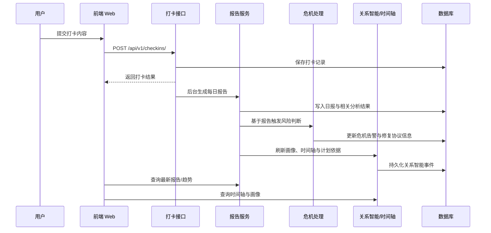

# 项目说明与验证

本文档只描述当前仓库里已经实现并可在代码、配置或测试中核验的能力，用于补充总览型 README。

## 接口总表

| 模块 | 代表接口 | 主要用途 | 鉴权方式 |
| --- | --- | --- | --- |
| 认证 | `/api/v1/auth/register` `/api/v1/auth/login` `/api/v1/auth/phone/login` | 注册、登录、手机号验证码与资料维护 | 注册/登录公开，其余需登录 |
| 配对 | `/api/v1/pairs/create` `/api/v1/pairs/join/preview` `/api/v1/pairs/{pair_id}/type` | 创建关系、加入预览、待确认加入/类型切换与关系状态管理 | 需登录 |
| 打卡 | `/api/v1/checkins/` `/api/v1/checkins/today` `/api/v1/checkins/history` | 提交打卡、查询今日打卡与历史记录 | 需登录 |
| 报告 | `/api/v1/reports/generate-daily` `/api/v1/reports/latest` `/api/v1/reports/trend` | 生成日报/周报/月报并查看趋势 | 需登录 |
| 文件上传 | `/api/v1/upload/image` `/api/v1/upload/voice` `/api/v1/upload/access/{subdir}/{filename}` | 图片与语音上传、签名访问私有资源 | 上传需登录，访问需签名 |
| 关系树 | `/api/v1/tree/status` `/api/v1/tree/water` | 查询成长状态、触发关系树相关反馈 | 需登录 |
| 危机预警 | `/api/v1/crisis/status/{pair_id}` `/api/v1/crisis/protocol/{pair_id}` `/api/v1/crisis/resources` | 查询风险等级、修复协议与专业资源 | 需登录 |
| 关系任务 | `/api/v1/tasks/daily/{pair_id}` `/api/v1/tasks/manual/{pair_id}` `/api/v1/tasks/{task_id}/feedback` | 系统任务、手动任务、完成记录与反馈回收 | 需登录 |
| 异地关系 | `/api/v1/longdistance/activities/{pair_id}` `/api/v1/longdistance/health-index/{pair_id}` | 异地陪伴活动与专项健康指数 | 需登录 |
| 里程碑 | `/api/v1/milestones/` `/api/v1/milestones/{pair_id}` `/api/v1/milestones/{milestone_id}/generate-review` | 关系里程碑记录与回顾生成 | 需登录 |
| 社群 | `/api/v1/community/tips` `/api/v1/community/notifications` | 社群提示、通知与生成式建议入口 | 需登录 |
| 智能陪伴 | `/api/v1/agent/sessions` `/api/v1/agent/simulate-message` `/api/v1/agent/asr/ws-ticket` | Agent 会话复用、聊天引导、发消息前预演与实时语音接入 | 需登录 |
| 关系智能 | `/api/v1/insights/profile/latest` `/api/v1/insights/timeline/archive` `/api/v1/insights/playbook/active` | 画像、时间轴归档导出、干预计划、playbook 运行态与叙事对齐 | 需登录 |
| 隐私沙盒 | `/api/v1/privacy/status` `/api/v1/privacy/audit/me` `/api/v1/privacy/delete-request` | 查看隐私状态、审计记录、发起删除申请 | 需登录 |
| 管理接口 | `/api/v1/admin/policies` `/api/v1/admin/privacy/audits` | 策略发布台、隐私审计、保留治理与回滚 | 需管理员权限 |

## 关键业务时序

说明：

- 打卡提交后会进入后台分析与自动报告链路。
- 风险判断与修复协议基于报告结果触发，不把单次界面操作直接描述成“人工判定”。
- 时间轴、画像与计划能力属于“关系智能”聚合层，面向后续解释与干预。

## 关系协作与归档补充

- 关系建立已不是“输邀请码立即成功”，而是“加入预览 -> 发起加入请求 -> 对方确认后生效”的协作流程。
- 关系类型切换同样需要双方确认，避免单方切换导致后续整理口径突然变化。
- 每日任务已经支持“系统生成 + 用户手动补充”混合方式，适合现场演示“今日安排”页。
- 时间轴归档支持导出；记录者本人可见原文和原媒体，对方默认只看到占位摘要，权限边界会体现在归档结果中。

## 测试覆盖矩阵

| 维度 | 代表测试文件 | 当前已验证内容 |
| --- | --- | --- |
| 认证与账号安全 | `test_auth_account_login.py` `test_auth_security.py` `test_phone_code_store.py` | 注册登录、手机号验证码、资料安全与偏好字段 |
| 配对、变更与解绑 | `test_pairs_security.py` `test_pairs_uuid_parameters.py` | 配对访问控制、加入确认、关系类型切换与解绑流程安全性 |
| 打卡与参数校验 | `test_checkin_persistence.py` `test_checkin_uuid_parameters.py` | 打卡落库、参数格式与历史读取 |
| 报告与危机流程 | `test_report_uuid_parameters.py` `test_crisis_uuid_parameters.py` `test_crisis_processor_uuid.py` `test_repair_protocol.py` | 报告链路、危机等级、修复协议和相关参数处理 |
| 文件上传与访问控制 | `test_upload_access.py` | 私有上传路径、签名访问、按用户或关系范围限制访问 |
| 隐私治理 | `test_privacy_phase2.py` `test_privacy_sandbox.py` | 隐私审计、删除申请、保留治理、脱敏日志与元数据记录 |
| 关系智能与归档 | `test_insights_routes.py` `test_timeline_insights.py` `test_timeline_archive_routes.py` `test_narrative_alignment.py` `test_behavior_judgement.py` `test_interaction_events.py` | 画像、时间轴、归档导出、叙事对齐、行为判断与互动事件 |
| 任务与反馈 | `test_task_security.py` `test_task_feedback.py` `test_tasks_uuid_parameters.py` `test_manual_tasks.py` | 系统任务、手动任务、反馈记录与参数校验 |
| 里程碑与关系树 | `test_milestones_uuid_parameters.py` `test_tree_uuid_parameters.py` | 里程碑与关系树的参数与接口行为 |
| 智能陪伴与会话记忆 | `test_agent_session_uuid.py` `test_agent_session_memory.py` `test_agent_realtime_asr.py` | 会话复用、会话摘要上下文和实时语音链路 |
| 运行时安全 | `test_main_security.py` | 生产环境弱配置拦截与验证码调试能力保护 |
| 前端工具与状态逻辑 | `src/utils/*.test.js` | 登录偏好、协议提示、首页摘要、关系空间、实时语音与报告内容等前端工具层逻辑 |
| OpenAPI 与依赖 | `test_main_openapi.py` `test_api_deps.py` `test_model_enums.py` | 标签说明、路由暴露、依赖注入和枚举定义 |

补充说明：

- 当前后端 `python -m pytest --collect-only -q` 复核可收集到 `223` 条测试。
- 当前前端 `npm test -- --run` 复核为 `101/101` 条工具层自动化测试全部通过。
- 前端 `npm run build` 已通过，可生成正式部署产物。
- 真实环境冒烟与轻量压测脚本已保留在 `output/`，最终提交或答辩前建议重新运行，生成当天证据。

## 隐私与安全

- 上传文件不会通过 Nginx 直接公网裸露，`/uploads/` 路径默认返回 404，避免把敏感资源当作公共静态文件暴露。
- 客户端拿到的是受时效控制的签名访问地址，后端会根据用户本人或配对成员范围决定是否放行。
- Web 层默认开启基础安全响应头，包括 `X-Content-Type-Options`、`X-Frame-Options`、`Referrer-Policy` 与 `Content-Security-Policy`。
- 数据库服务在 Compose 中仅使用内部暴露，不把 PostgreSQL 端口默认映射到公网。
- 隐私治理不只停留在文案，当前已有隐私状态查询、删除申请、管理员审计与保留清理接口，并有对应测试覆盖。

## 系统边界与转介原则

- 系统用于关系记录、趋势观察、风险提示和沟通辅助，不替代真实沟通。
- 模型输出属于辅助建议，不作为医疗、法律或心理诊断依据。
- 当冲突持续升级、出现明显安全顾虑或用户主观感受已超出普通沟通支持范围时，应优先暂停升级性对话。
- 对于中高风险场景，系统提供的是“先稳住边界、再转向支持网络或专业帮助”的辅助方向，而不是强制结论。

## 相关文档

- 总览入口见 [../README.md](../README.md)。
- 部署说明见 [../DEPLOY.md](../DEPLOY.md)。
